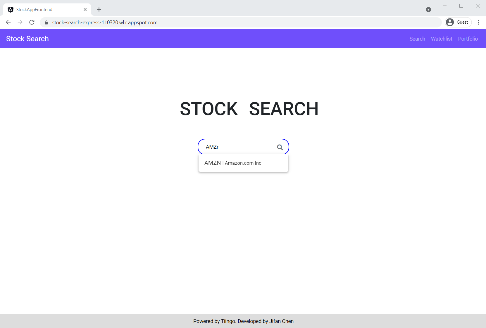
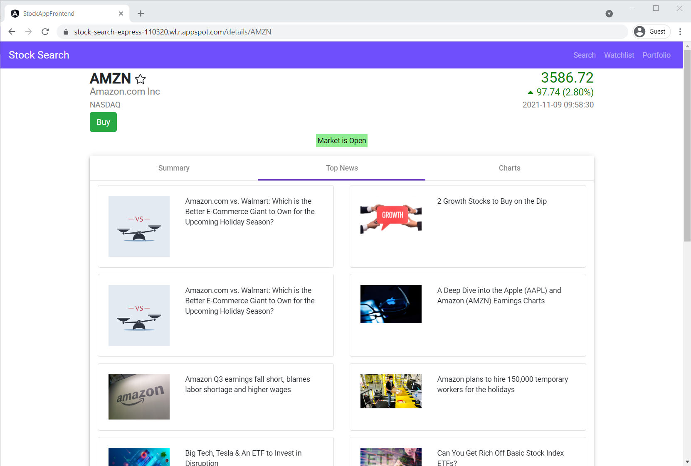
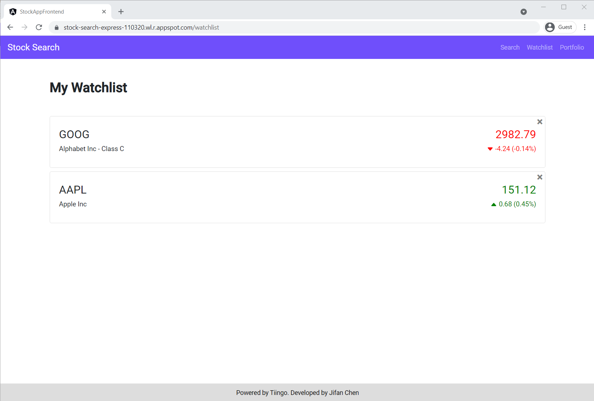
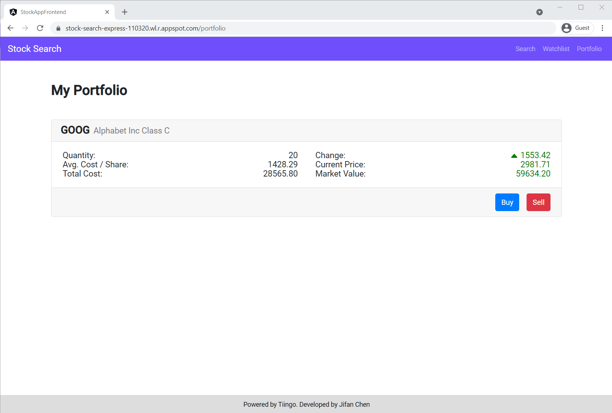
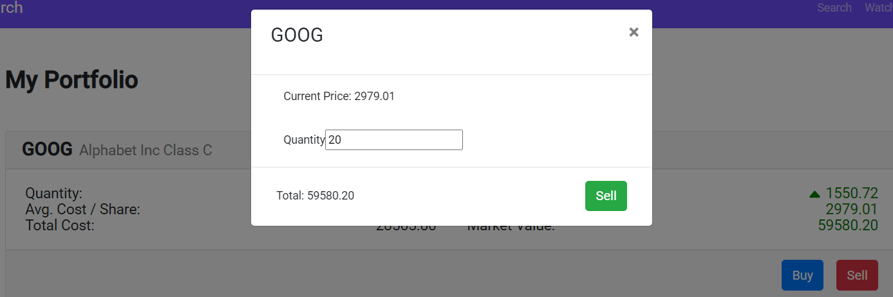

# Stock Web App Frontend

This project was generated with [Angular CLI](https://github.com/angular/angular-cli) version 10.1.7.

This is a client side-web app developed using HTML5, Bootstrap and Angular.js. It interacts with server-side app written in Node.js to support stock search, trade (simulation) and data visualization functionalities. The app is deployed on Google App Engine (GAE).

## High level description   

There are 4 routes for this application:

- Homepage/ Search Route [‘/’] – It is a default route of this application.
- Watchlist Route [‘/watchlist’] – It displays the watchlist of the user.
- Portfolio Route [‘/portfolio’] – It displays the portfolio of the user.
- Details Route [‘/details/<ticker>’] – It shows the details of the <ticker>.

## Demo screenshots

* Search page

  

* Stock details page

  

  

  

* Watchlist page

  

* Portfolio page

  

  

## Development server

Run `ng serve` for a dev server. Navigate to `http://localhost:4200/`. The app will automatically reload if you change any of the source files.

## Code scaffolding

Run `ng generate component component-name` to generate a new component. You can also use `ng generate directive|pipe|service|class|guard|interface|enum|module`.

## Build

Run `ng build` to build the project. The build artifacts will be stored in the `dist/` directory. Use the `--prod` flag for a production build.

## Running unit tests

Run `ng test` to execute the unit tests via [Karma](https://karma-runner.github.io).

## Running end-to-end tests

Run `ng e2e` to execute the end-to-end tests via [Protractor](http://www.protractortest.org/).

## Further help

To get more help on the Angular CLI use `ng help` or go check out the [Angular CLI README](https://github.com/angular/angular-cli/blob/master/README.md).
